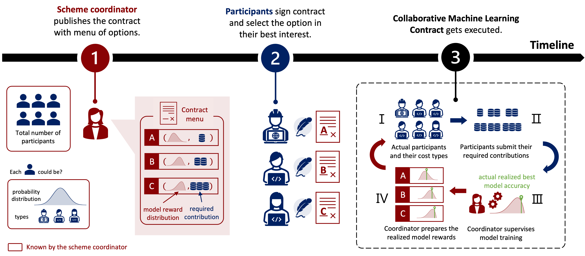
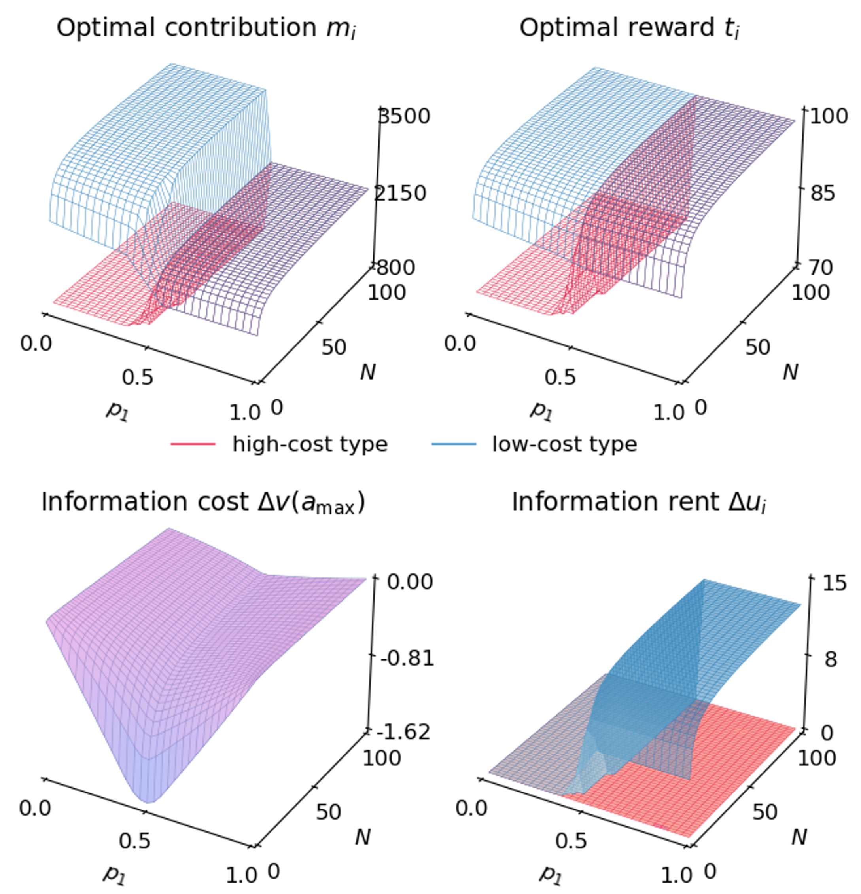
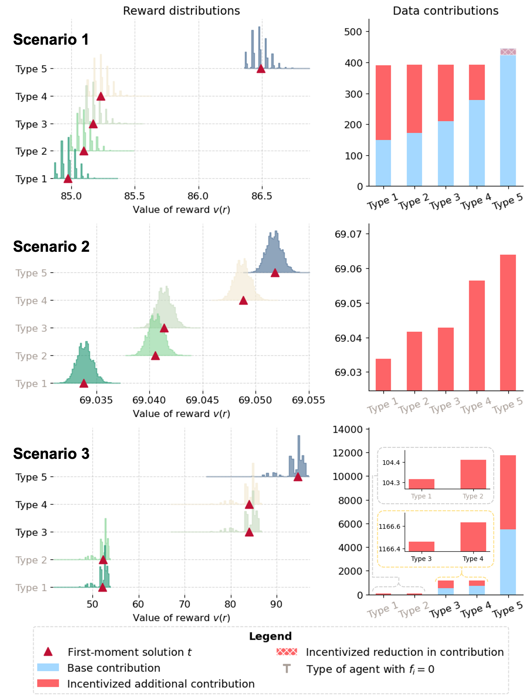

# Paid with Models: Optimal Contract Design for Collaborative Machine Learning
Codebase for "Paid with Models: Optimal Contract Design for Collaborative Machine Learning". Implementation and experiments of optimal contracting design for incentivizing machine learning collaboration.

[](LICENSE)
[](https://github.com/bingchen-wang/paid-with-models)



## Author & Contact Information
- **Name:** [Bingchen Wang](https://github.com/bingchen-wang)  
- **Email:** [bw2506@columbia.edu](mailto:bw2506@columbia.edu)  
- **Institution/Organization:** National University of Singapore (NUS)
- **Website/Portfolio:** [Bingchen's Google Site](https://sites.google.com/view/bingchenwang/)

## Requirements
Ensure Python dependencies are met by installing the following:

```bash
pip install -r requirements.txt
```

## Replication of Paper Results

### Section 6.1 Two-type Case
<div style="text-align: center; width: 50%; margin: 0 auto;">
  
  <p style="text-align: left; line-height: 1.6;">
    <strong>Top:</strong> Optimal contracts under incomplete information for varied probability of high-cost type 
    $p_1 \in (0,1)$ and total number of participants 
    $N \in [2, 100]$, with $c = \{0.02, 0.01\}$. <br>
    <strong>Bottom:</strong> Information costs for the coordinator and information rents for the parties under incomplete information vis-à-vis complete information.
  </p>
</div>

<div align="center">
  
  <p style="text-align: center;">
    <strong>Top:</strong> Optimal contracts under incomplete information for varied probability of high-cost type 
    $p_1 \in (0,1)$ and total number of participants 
    $N \in [2, 100]$, with $c = \{0.02, 0.01\}$. <br>
    <strong>Bottom:</strong> Information costs for the coordinator and information rents for the parties under incomplete information vis-à-vis complete information.
  </p>
</div>

> You can replicate Section 6.1 by running the script [📜 Experiment_Twotype_Case.ipynb](Experiment_Twotype_Case.ipynb).


You can replicate Section 6.1 by running the script [📜 Experiment_Twotype_Case.ipynb](Experiment_Twotype_Case.ipynb).

### Section 6.2 Multi-type Case
<div style="text-align: center; width: 50%; margin: 0 auto;">
  
  <p style="text-align: left; line-height: 1.6;">
    Optimal contract designs for multi-type scenarios. <br> 
    <strong>Scenario 1:</strong> All types would train a model on their own. <br> 
    <strong>Scenario 2:</strong> All types would not train a model on their own due to prohibitive costs. <br> 
    <strong>Scenario 3:</strong> Some types would train the model on their own and others would not.
  </p>
</div>

You can replicate Section 6.2 by running the script [📜 Experiment_Multitype_Case.ipynb](Experiment_Multitype_Case.ipynb).

### Appendix A.1 Related Work
<div style="text-align: center; width: 50%; margin: 0 auto;">
  
  <p style="text-align: left; line-height: 1.6;">
    Functions $f$ and $g$ and the $m_1$'s that give the maximum values.
  </p>
</div>

You can replicate Appendix A.1 by running the script [📜 Appendix_A_Related_Work.ipynb](Appendix_A_Related_Work.ipynb).

## Additional Experiments
